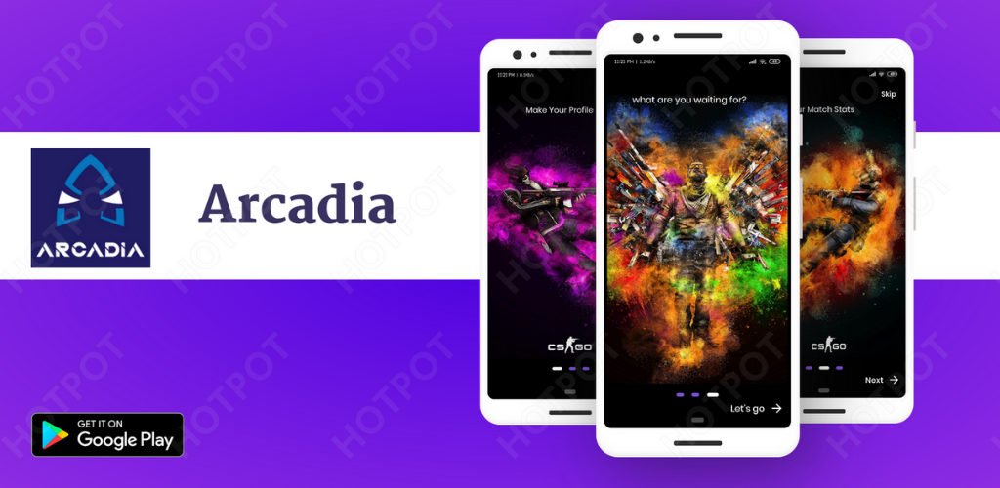
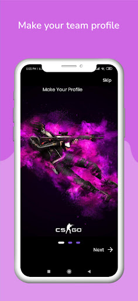
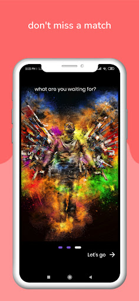
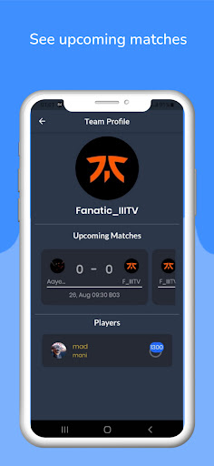
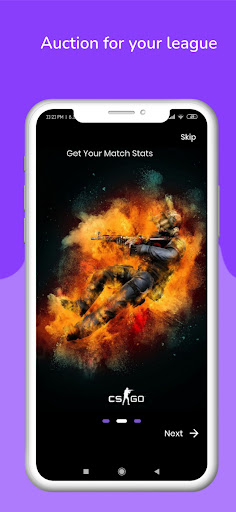
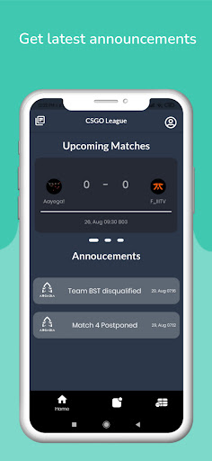

# Arcadia Auction - CSGO Tournment

</img>

 
<!-- An App where all the details about a tournament can be found. -->

Want to get the best esports experience? Want to be updated about your favorite teams? Arcadia Auction is a one stop solution to all your tournament needs with a simple UI and lot of features. Track your favortite teams and players , know who is dominating the server and when is the next match.

 

    </img>
    </img>
    </img> 
     
    </img> 
    </img>
      

 

## 💻Tech Stack

- Flutter
- Firebase

 

## 🤓 Contributors

- [Ashish Kumar Singh](https://github.com/AshishSingh2001)
- [Kapil Kumar](https://github.com/kapilkumar2001)
- [Nishant Andoriya](https://github.com/M-A-D-A-R-A)
